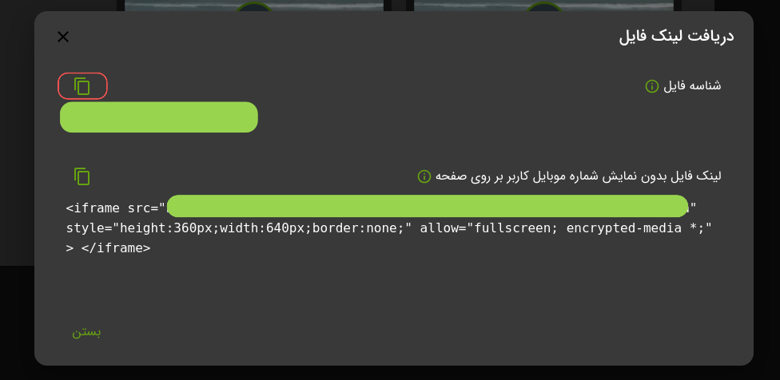

برای پیاده سازی سریع ابتدا کافیست وارد پنل
[VidProtect][]
شوید سپس در قسمت ویدیو های من بر روی **`دریافت لینک فایل`** کلیک کرده و **`شناسه فایل`** را کپی کنید.

### قدم اول


### قدم دوم



بعد از کپی شناسه فایل درخواست خود را میتوانید با استفاده از CURL و یا
[API][]
ارسال کنید.

```shell
curl -X 'POST' \
  'https://api.vidprotect.ir/v1/storage/bucket/file/generate/link' \
  -H 'accept: application/json' \
  -H 'api_key: your_api_key' \
  -H 'secret_key: your_secret_key' \
  -H 'Content-Type: application/json' \
  -d '{
  "fileId": "_id",
  "mobileNumber": "0900000000"
}'
```

:::note
مقادیر بالا نیازمند تغییر است.

1. بجای api_key و secret_key کلید های احراز هویت خود از
   این [آدرس][] دریافت کرده و جایگزین کنید.
2. شناسه فایل کپی شده را با _id جایگزین کنید.
3. شماره موبایل را به شماره موبایل کاربرتان تغییر دهید.
   :::

:::info
همچنین شما می توانید امکانات مختلف ویدپروتکت به ازای هر لینک تغییر دهید برای اطلاع بیشتر به
این [آدرس](./file/03-generate-link.md) مراجعه کنید.
:::

## پخش در اپلیکیشن ها

در صورتی که از خدمات ما در سمت اپلیکیشن می خواهید استفاده کنید، تنها کافیست یک API برای ساخت لینک پخش، پیاده سازی کرده و
سپس لینک دریافتی را در یک محیط شبه وب در اپلیکیشن خود نمایش دهید

برای اپلیکیشن‌های مختلف، می‌توانید از یکی از موارد زیر استفاده کنید:

اندروید: [WebView][]

آیفون (iOS):  [WKWebView][]

دسکتاپ: [WebView2][]

فلاتر: [WebViewController][]

:::warning
از ذخیره و یا استفاده API KEY, SECRET KEY در سمت کلاینت جدا خودداری فرمایید.
:::

[VidProtect]: https://vidprotect.ir/panel

[API]: ./file/03-generate-link.md#نمونه-کد

[آدرس]: https://vidprotect.ir/panel/settings/security-settings

[WebView]: https://developer.android.com/develop/ui/views/layout/webapps/webview

[WKWebView]: https://developer.apple.com/documentation/webkit/wkwebview

[WebView2]: https://learn.microsoft.com/en-us/microsoft-edge/webview2/get-started/winforms

[WebViewController]: https://codelabs.developers.google.com/codelabs/flutter-webview#0
