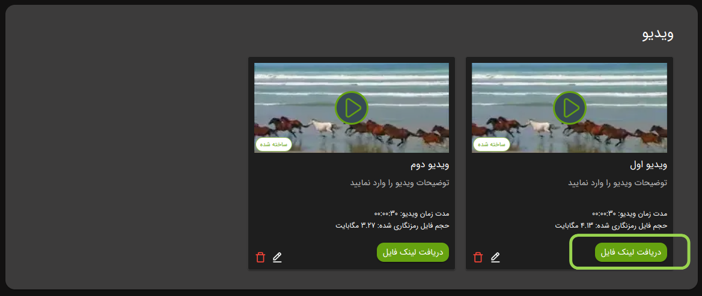

# لینک مستقیم در ویدپروتکت

با استفاده از قابلیت **لینک مستقیم** می‌توانید لینک ویدئوهای خود را در هر جایی (مانند شبکه‌های اجتماعی، وبسایت‌ها یا
اپلیکیشن‌ها) قرار دهید **بدون محدودیت**.  
در این حالت، ویدئوهای شما همچنان **غیرقابل دانلود** خواهند بود و فقط **شماره موبایل کاربر روی ویدئو نمایش داده نمی‌شود
**.

> این ویژگی زمانی کاربردی است که بخواهید ویدئوهایتان را مستقیماً در پلتفرم‌های دیگر نمایش دهید، اما همچنان امنیت محتوا
> حفظ شود.

## نحوه استفاده

1. وارد پنل [VidProtect][] شوید.
2. به بخش **`ویدیوهای من`** بروید.
3. روی گزینه **`دریافت لینک فایل`** کلیک کنید.
4. کد **`iframe`** ارائه‌شده را کپی و در محل مورد نظر (وبسایت، شبکه اجتماعی و...) قرار دهید.

### قدم اول

### قدم دوم

:::info
برای جلوگیری از انتشار ناخواسته لینک، می‌توانید فایلی که لینک آن منتشر شده را **حذف** کنید تا دیگر در دسترس نباشد.
:::

[VidProtect]: https://vidprotect.ir/panel
