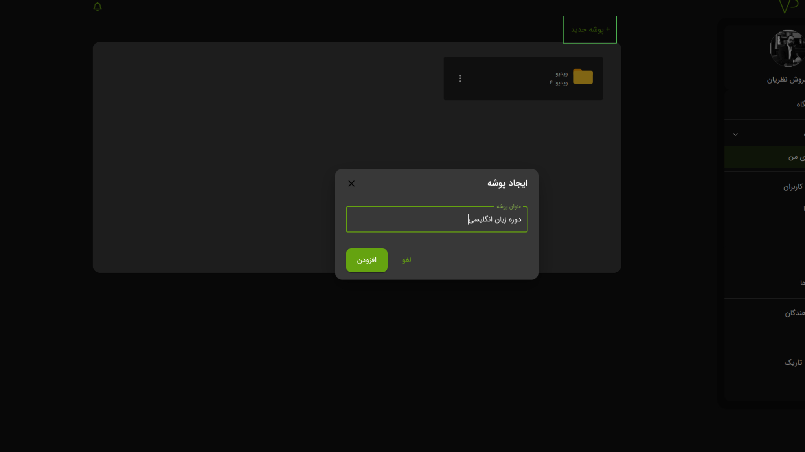
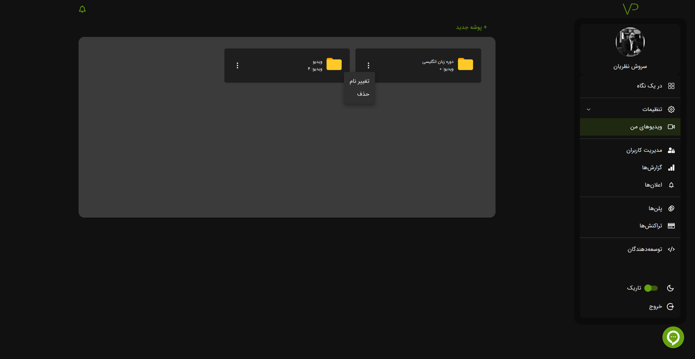
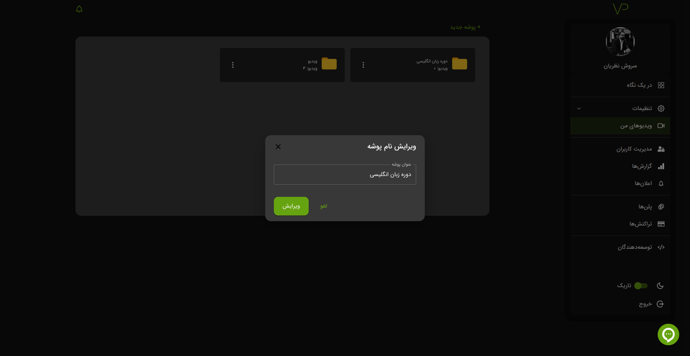

# پوشه

## ساخت

برای ساخت پوشه ابتدا وارد پنل کاربری،
[ویدیو های من](https://vidprotect.ir/panel/videos)
شده و سپس بر روی ساخت پوشه کلیک کنید.

در پنجره باز شده نام پوشه خود را وارد کنید و سپس روی گزینه **افزودن** کلیک کنید.

## ویرایش

برای ویرایش پوشه بر روی ایکون ︙ کلیک کنید.

سپس پوشه خود را ویرایش کنید.

## حذف

برای حذف پوشه بر روی ایکون ︙ کلیک کنید.

:::warning
در صورت حذف پوشه تمام ویدیو یا پادکست و اطلاعات آماری درون آن پوشه حذف می شود. در صورت حذف پوشه امکان بازگشت اطلاعات
وجود ندارد.
:::

