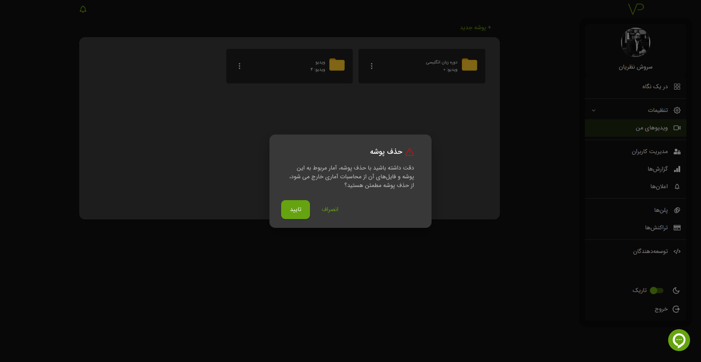

# پوشه

## ساخت پوشه

برای ساخت پوشه، ابتدا وارد پنل کاربری شوید و به بخش [ویدیوهای من][] بروید. سپس روی گزینه **`پوشه جدید`** کلیک کنید.

در پنجره باز شده، نام پوشه خود را وارد کرده و بر روی گزینه **`افزودن`** کلیک کنید.

---

## ویرایش پوشه

برای ویرایش پوشه، روی آیکون `︙` کنار پوشه کلیک کنید.

سپس تغییرات مورد نظر خود را اعمال کنید.

---

## حذف پوشه

برای حذف پوشه، مانند ویرایش آن، روی آیکون `︙` کلیک کنید.

:::warning
در صورت حذف پوشه، تمامی ویدیوها، پادکست‌ها و اطلاعات آماری موجود در آن حذف خواهند شد.  
**این عملیات غیرقابل بازگشت است. لطفاً با دقت عمل کنید.**
:::

---

[ویدیوهای من]: https://vidprotect.ir/panel/videos
