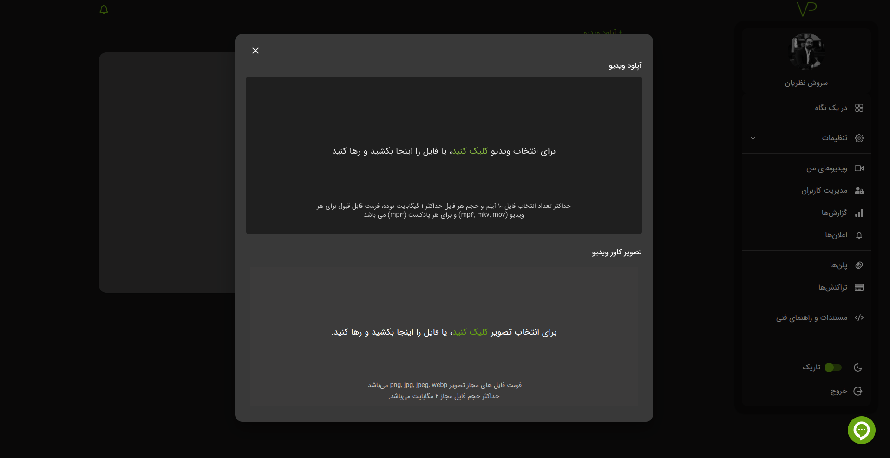

# ویدیو یا پادکست

## بارگذاری ویدیو یا پادکست

برای بارگذاری ویدیو یا پادکست شما نیازمند داشتن پوشه هستید. اگر با روش ساخت پوشه آشنا نیستید به این
[آدرس][]
مراجعه کنید.

برای آپلود فایل کافیست وارد پوشه مورد نظر خود شوید، سپس با کلیک بر روی گزینه **`آپلود ویدیو`** می توانید ویدیو یا پادکست های خود را بارگذاری کنید.

## حذف یا ویرایش

مانند پوشه میتوانید ویدیو یا پادکست را حذف یا ویرایش کنید، همچنین میتوانید کاور ویدیو را از قسمت ویرایش تغییر دهید.

[آدرس]: ./bucket#ساخت-پوشه
