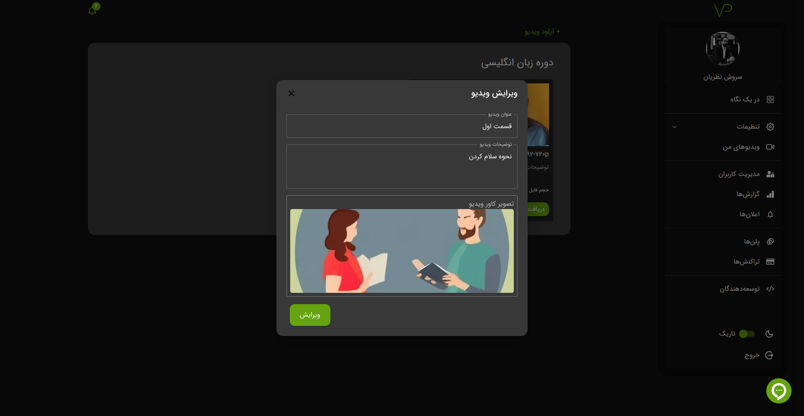

# ویدیو یا پادکست

## بارگذاری ویدیو یا پادکست

برای بارگذاری ویدیو یا پادکست، ابتدا باید یک پوشه ایجاد کنید. اگر با نحوه ساخت پوشه آشنا نیستید، به این [لینک](./bucket#ساخت) مراجعه کنید.

برای آپلود فایل، به پوشه مورد نظر خود بروید و روی گزینه **`آپلود ویدیو`** کلیک کنید. سپس می‌توانید ویدیو یا پادکست‌های خود را بارگذاری کنید.

## حذف یا ویرایش

مانند پوشه‌ها، امکان حذف یا ویرایش ویدیو یا پادکست نیز وجود دارد. همچنین می‌توانید کاور ویدیو را از طریق آیکون `✎` ویرایش کرده و محتوای فایل را تغییر دهید.

