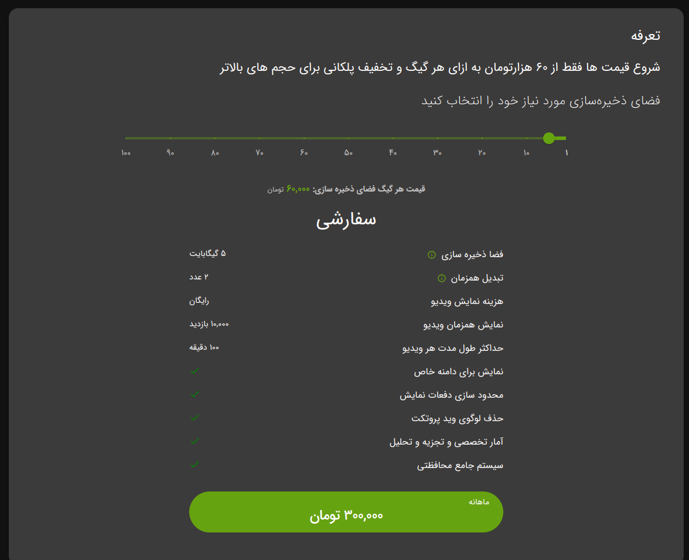

# حق اشتراک

سرویس
[ویدپروتکت](https://vidprotect.ir)
مانند بقیه سرویس های اینترنتی نیازمند تهیه حق اشتراک است. و برای راحتی شما عزیزان، امکان استفاده ۱۴ روزه آزمایشی بصورت
رایگان وجود دارد.
برای فعال سازی آن تنها کافیست اولین اکانت
[ویدپروتکت](https://vidprotect.ir/auth/register)
خود را بسازید تا از امکانت سرویس بهره لازم را ببرید.

## تعرفه ها

بطور کلی در ۴ سطح امکان تهیه تعرفه وجود دارد.

### رایگان

تنها با ساخت اولین اکانت
[ویدپروتکت](https://vidprotect.ir)
قابل استفاده می باشد و بعد از منقضی شدن پلن دیگر قابل تمدید نمی باشد.

### حرفه ای و یا سازمانی

اگر شما در صاحب کسب و کار هستید و دنبال فضای ذخیره سازی میگردید که حجم زیادی را دارا باشد و همچنین بصورت روزانه ۱۰ ای ۱۵
ویدیو در طول روز بارگذاری می شود، میتوانید یکی از تعرفه ها را برای کسب و کار خود انتخاب کنید.

### سفارشی

اگر کسب و کار شما محدود به یک حوزه خاص می شود و بصورت ماهانه ویدیو های جدید بارگذاری می کنید میتوانید از این تعرفه
استفاده کنید.

## ارتقای سرویس

برای تغییر تعرفه وارد
[آدرس](https://vidprotect.ir/panel/subscription-upgrade)
شوید. سپس تعرفه خود را انتخاب کنید.

:::note
قابلیت downgrade تنها برای تعرفه سفارشی امکان پذیر است.
:::

:::note
در صورت تغییر تعرفه تمدید شده، تعرفه قبلی به صورت کلی از بین می رود.
:::

## تمدید سرویس

برای تمدید تعرفه وارد
[آدرس](https://vidprotect.ir/panel)
شوید. سپس بر روی تمدید اشتراک فعلی کلیک کنید.

:::note
امکان پرداخت تعرفه بصورت چند ماه پشت سرهم وجود دارد.
:::

:::note
در صورت تمدید تعرفه مدت زمان روز های باقی مانده و مبلغ هر روز محاسبه می شود و سپس بر روی تعرفه جدید اعمال می شود.
:::