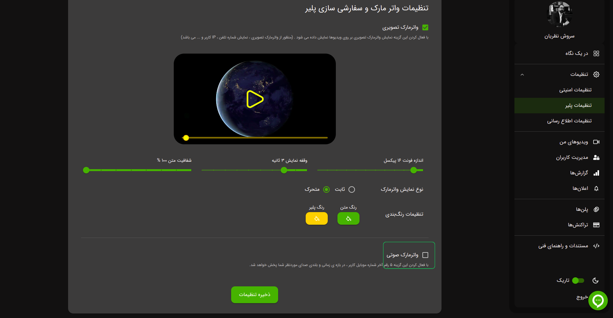

قابلیت واترمارک صوتی در ویدپروتکت به شما امکان می‌دهد تا فایل‌های صوتی را به شکلی حرفه‌ای و ایمن شخصی‌سازی کنید. این
ویژگی شامل تنظیم میزان صدا برای هماهنگی بهتر با محتوای اصلی و همچنین امکان تعیین تعداد تکرار صدای واترمارک در طول فایل
است. با استفاده از این قابلیت، می‌توانید امنیت و هویت محتوای خود را با روش‌های خلاقانه تقویت کنید.

## افزودن واترمارک صوتی

1. وارد پنل کاربری خود شوید
2. بر روی گزینه تنظیمات پلیر کلیک کنید
3. واترمارک صوتی را فعال کنید

