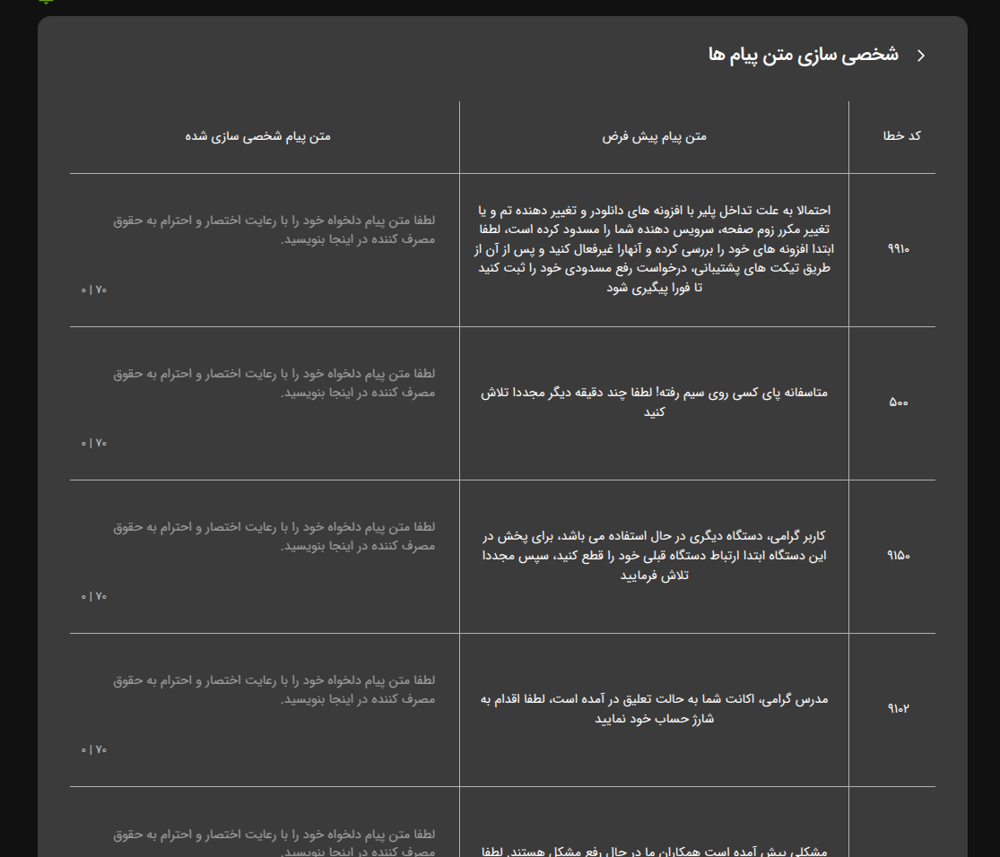

ویدپروتکت این امکان را برای مدیران سایت فراهم کرده است که پیام‌های نمایش داده‌شده به کاربران از طریق پلیر را شخصی‌سازی
کنند. در ادامه با نحوه ویرایش این پیام‌ها بیشتر آشنا خواهید شد.

## پیکربندی

1. وارد پنل کاربری خود شوید
2. بر روی تنظیمات امنیتی کلیک کنید
3. در انتهای صفحه بر روی گزینه "شخصی سازی پیام ها" کلیک کنید

در انتها از بین پیام های ارائه شده متن مورد نظر خود را وارد کنید و بر روی گزینه **ذخیره** کلیک کنید

 