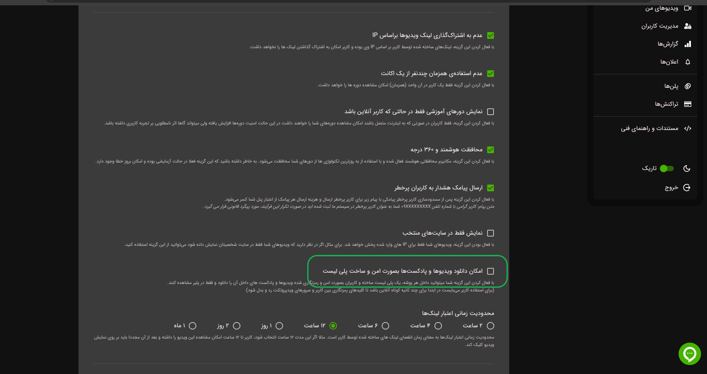
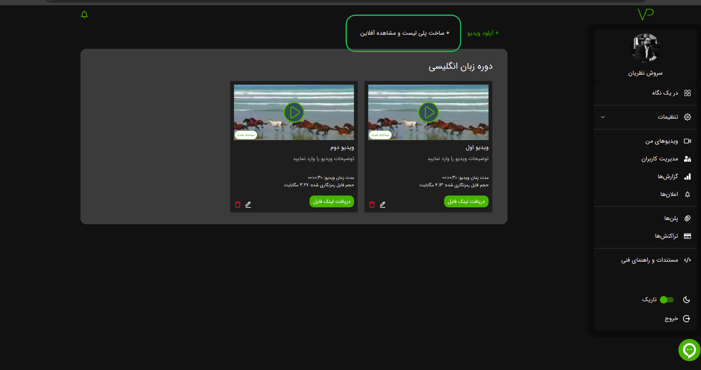
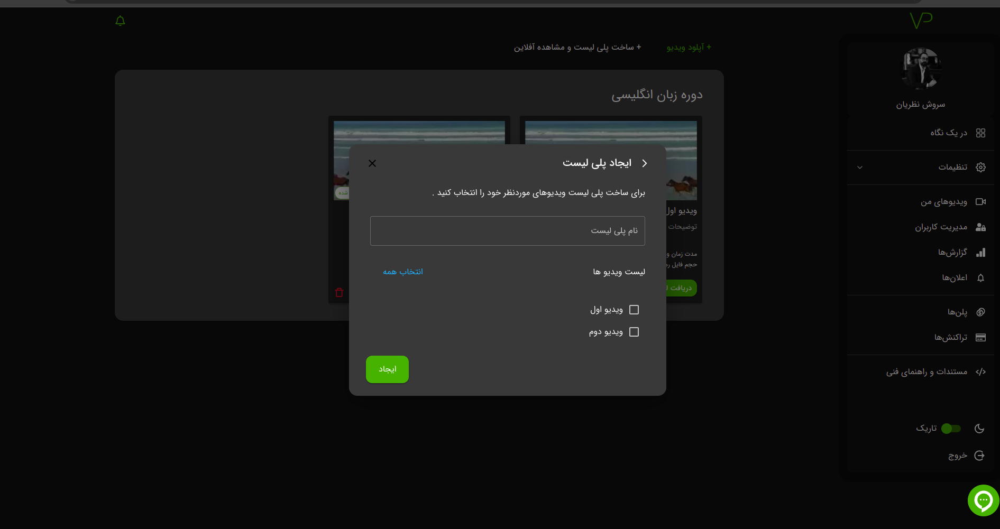
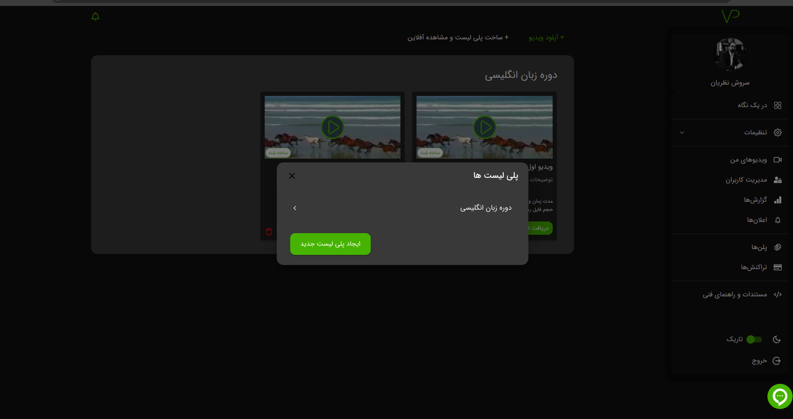
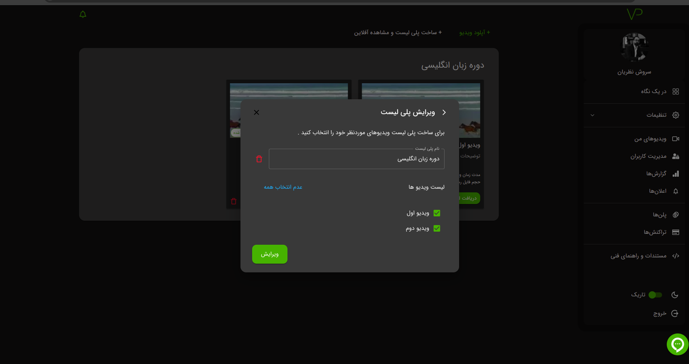
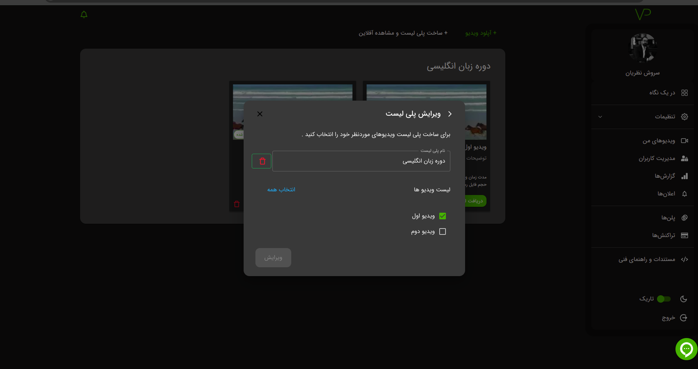
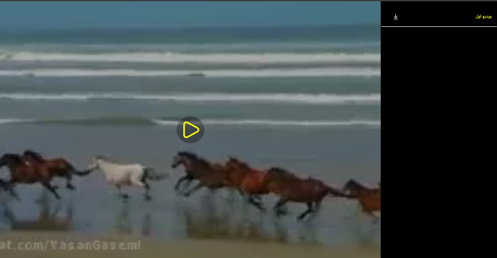

هدف از طراحی پلی لیست، امکان ایجاد یک لیست از ویدیوها برای نمایش به کاربران است. این امکان به شما کمک می‌کند تا
ویدیوهای مورد نظر خود را در یک لیست جمع‌آوری کرده و به صورت یک پلی لیست به کاربران خود ارائه دهید.

:::note
در صورت فعال سازی پلی لیست کاربر امکان دانلود محتوا را دارد این محتوا بصورت امن به کاربر نمایش داده می شود همچنین کاربر
می تواند بصورت آفلاین محتوا را نگاه کند
:::

:::info
برای استفاده کاربر می‌بایست در ابتدا برای چند ثانیه کوتاه آنلاین باشد تا کلیدهای رمزنگاری بین کاربر و سرورهای ویدپروتکت
رد و بدل شود
:::

### ایجاد پلی لیست

در قدم اول باید گزینه استفاده از پلی لیست را از بخش تنظیمات امنیتی پنل کاربری خود فعال کنید.

به پوشه‌ای که قصد دارید پلی ‌لیست را در آن ایجاد کنید، مراجعه و بر روی گزینه زیر کلیک کنید

در قدم بعدی عنوان و ویدیو های خود را انتخاب کرده و سپس بر روی گزینه **ایجاد** کلیک کنید

### ویرایش پلی لیست

برای ویرایش پلی لیست بر روی گزینه زیر کلیک کنید

پلی لیست خود را انتخاب کنید

در انتها تغییرات خود را اعمال کرده و سپس بر روی گزینه **ویرایش** کلیک کنید

### حذف پلی لیست

برای حذف پلی لیست بر روی گزینه زیر کلیک کنید

پلی لیست خود را انتخاب کنید

در انتها بر روی گزینه زیر کلیک کنید

### نحوه نمایش در پلیر

به منظور مشاهده خروجی از پلی لیست باید از طریق [API](../../developers/00-setup.md) با هر اکانتی غیر از
اکانت مدرس لینک بسازید

