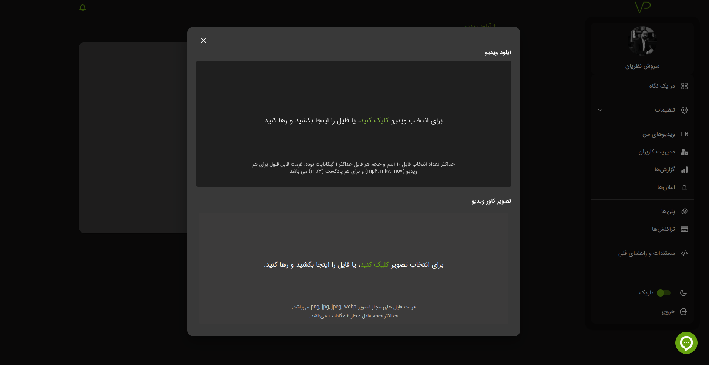
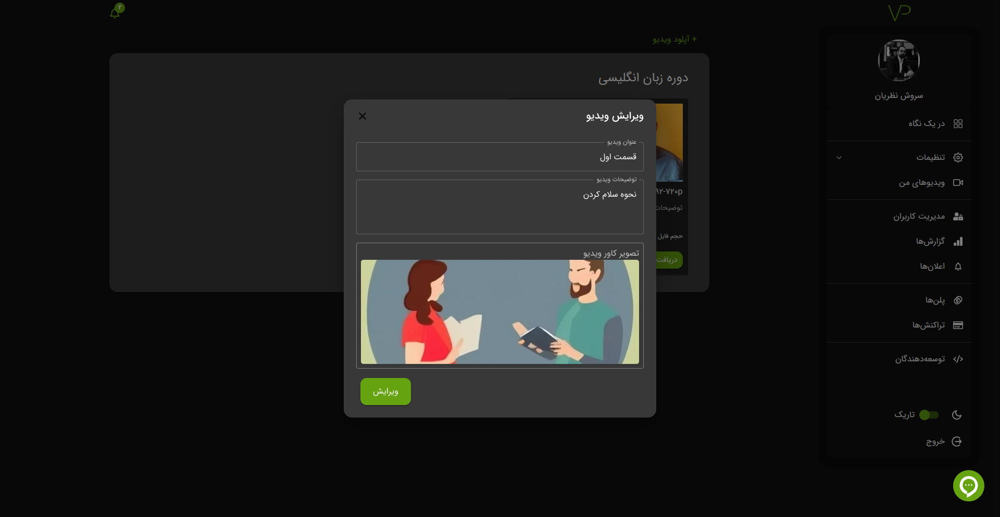

# فایل

## مقدمه

در حال حاضر فایل‌های شما صرفاً می‌توانند از نوع ویدیو یا پادکست و با فرمت‌های زیر باشند:  
`mp4`, `mp3`, `mkv`, `mov`

#### نکات مهم هنگام آپلود ویدیو یا پادکست:

- فرآیند آپلود به‌صورت یک یا چند فایل امکان‌پذیر است.
- به دلیل استفاده از رمزنگاری دو مرحله‌ای، فرآیند ساخت فایل‌ها زمان‌بر بوده و مدت آن به حجم و کیفیت فایل بستگی دارد.
- حجم نهایی فایل‌های ساخته‌شده معمولاً سه برابر حجم فایل اصلی است.
- در حال حاضر آپلود ویدیو یا پادکست با حداکثر حجم **یک گیگابایت** امکان‌پذیر است. (در صورت نیاز، این محدودیت قابل ارتقا است)
- فضای ذخیره‌سازی بر اساس اندازه فایل‌های رمزنگاری‌شده محاسبه می‌شود.
- محدودیت حداکثر طول مدت هر ویدیو بر اساس پلن انتخابی اعمال می‌شود.

:::info
در صورت مغایرت فرمت یا وجود مشکل در پردازش فایل، می‌توانید از ابزارهای انکودر مانند:

* [FFmpeg](https://ffmpeg.org/download.html)
* [HandBrake](https://handbrake.fr/downloads.php)
* [QwinFF](https://qwinff.github.io/downloads.html)

برای تبدیل فایل به یکی از فرمت‌های پشتیبانی‌شده (`mp4`, `mp3`, `mkv`, `mov`) استفاده کنید.

**ابزار پیشنهادی:**
- [HandBrake](https://handbrake.fr/downloads.php)
  :::

## نحوه بارگذاری

برای بارگذاری ویدیو یا پادکست، ابتدا باید یک پوشه ایجاد کنید. اگر با نحوه ساخت پوشه آشنا نیستید، به این [لینک](./bucket#ساخت) مراجعه کنید.

برای آپلود فایل، به پوشه مورد نظر خود بروید و روی گزینه **`آپلود ویدیو`** کلیک کنید. سپس می‌توانید ویدیو یا پادکست‌های خود را بارگذاری کنید.

## حذف یا ویرایش

مانند پوشه‌ها، امکان حذف یا ویرایش ویدیو یا پادکست نیز وجود دارد. همچنین می‌توانید کاور ویدیو را از طریق آیکون `✎` ویرایش کرده و محتوای فایل را تغییر دهید.

