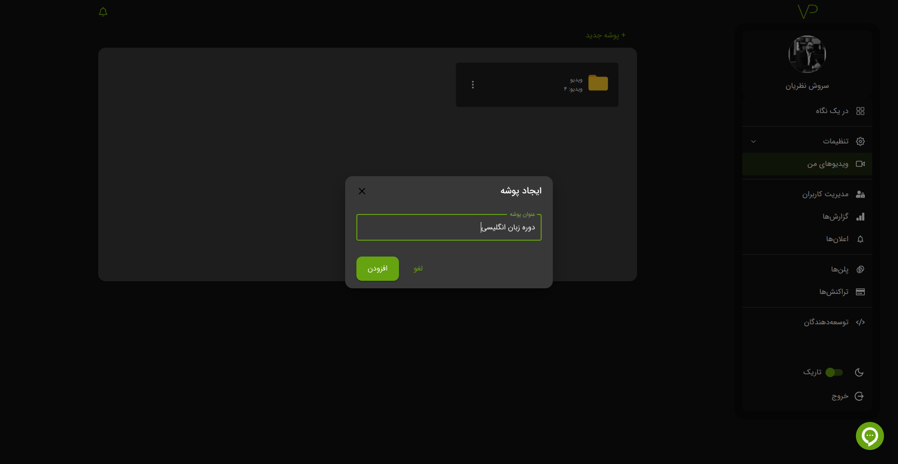
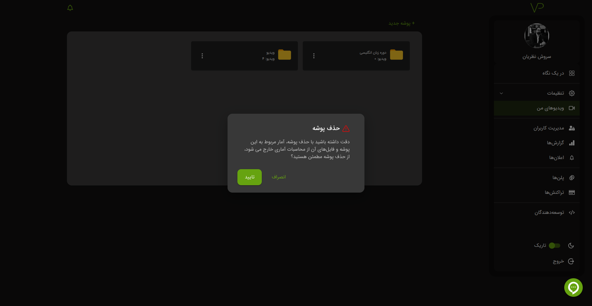

# باکت

## ساخت

برای ساخت باکت وارد
[آدرس](https://vidprotect.ir/panel/videos)
شوید. سپس بر روی پوشه جدید کلیک کنید.

در پنجره باز شده نام باک خود را وارد کنید و سپس روی گزینه **افزودن** کلیک کنید.

## ویرایش

برای ویرایش باکت بر روی کزینه بیشتر کلیک کنید.

سپس باکت خود را ویرایش کنید.

## حذف

برای حذف باکت بر روی کزینه بیشتر کلیک کنید.

**نکته:** در صورت حذف باکت تمام فایل و اطلاعات آماری درون آن باکت حذف می شود. در ضورت جذف باکت امکان بازگشت وجود ندارد.

