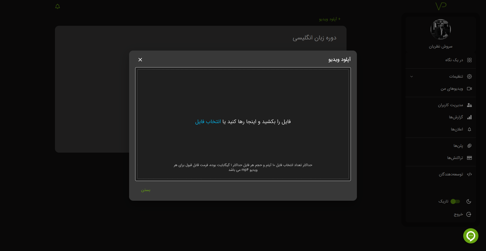
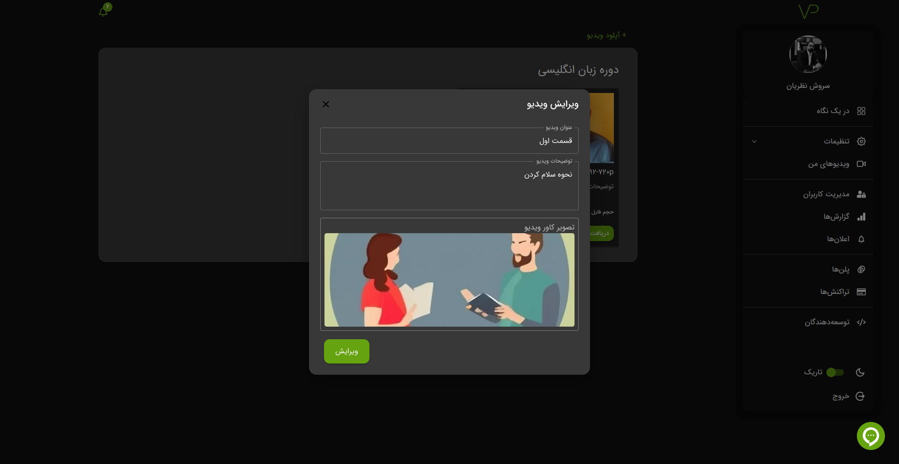

# فایل

## بارگذاری فایل

برای بارگذاری فایل شما نیازمند داشتن باکت هستید. اگر با روش ساخت باکت آشنا نیستید به این
[آدرس](./bucket#ساخت-باکت)
مراجعه کنید.

**پیشنهاد:** برای اطلاع بیشتر با موارد مهم موقعه آپلود به این
[آدرس](./definitions#موارد-حائز-اهمیت-در-موقع-آپلود-فایل)
مراجعه کنید.

در نهایت با کلیک بر روی گزینه **آپلود ویدیو** فایل های خود را بارگذاری کنید.

## حذف یا ویرایش

مانند باکت میتوانید فایل را حذف یا ویرایش کنید، همچنین میتوانید کاور ویدیو را از قسمت ویرایش تغییر دهید.

