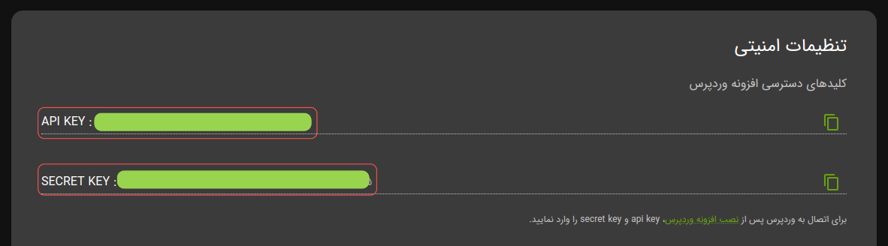
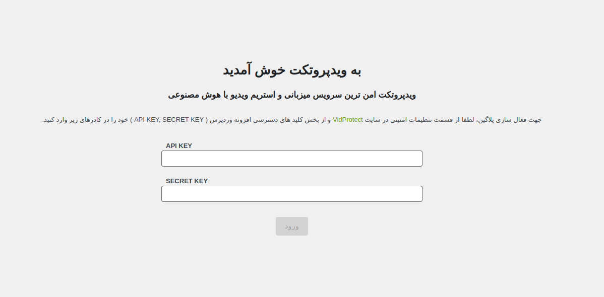

## مراحل فعال سازی پلاگین

برای فعال سازی پلاگین، ابتدا نیاز است که **`API KEY`** و **`SECRET KEY`** را از طریق پنل کاربری خود پیدا کنید. برای این کار:

1. وارد پنل کاربری شوید.
2. به بخش **تنظیمات** و سپس **تنظیمات امنیتی** بروید.

پس از دریافت **`API KEY`** و **`SECRET KEY`**، این مقادیر را در پلاگین وردپرس خود وارد کنید. برای این کار:

1. به تنظیمات پلاگین وردپرس بروید.
2. **`API KEY`** و **`SECRET KEY`** را در کادرهای متناظر وارد کنید تا ارتباط با سرورهای ویدپروتکت برقرار شود.

