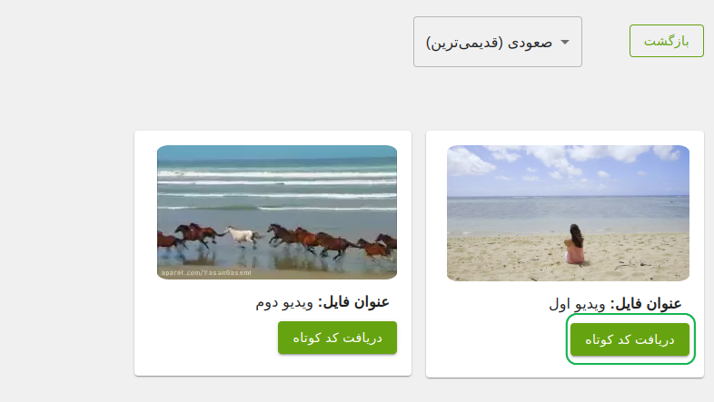

بعد از فعال‌سازی موفق پلاگین، لیست تمام ویدیوها و پادکست‌های شما به صورت یک لیست جامع در دسترس قرار می‌گیرد.

برای اضافه کردن لینک‌ها به داخل وبسایت، کافی است که لینک مورد نظر خود را از قسمت (**`لینک`**) کپی کرده (یا بر روی آن کلیک کنید تا به صورت اتوماتیک کپی شود) و در صفحه مورد نظر خود وارد کنید.

### قدم اول

### قدم دوم

:::info
برای نمایش اتوماتیک واترمارک به کاربر بر روی صفحه هنگام پخش ویدیو، به این [آدرس](./07-show-watermark.md) مراجعه کنید.
:::
