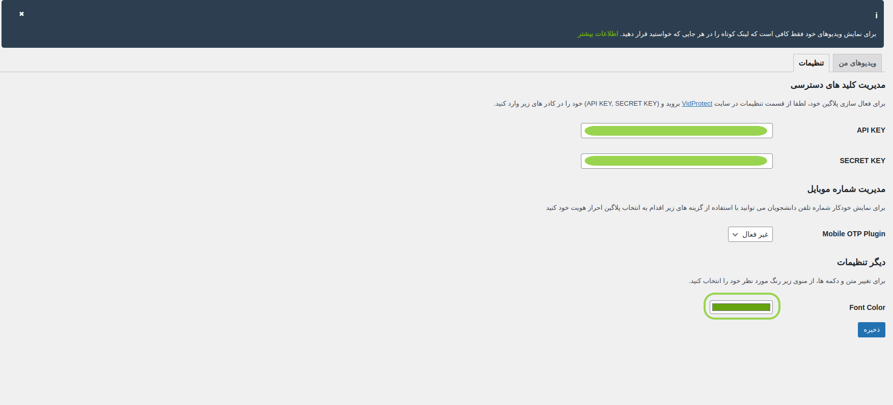

برای شخصی سازی Iframe تنها کافی است محتویات کلاس `.vidprotect-ready` را تغییر دهید.

با استفاده از این قابلیت میتوانید ابعاد ویدیو و محل قرار گیری آن و ... را تغییر دهید.



### Default CSS

```css
.vidprotect-ready {
    border: none;
    border-radius: 15px;
    inset: 0;
    width: 100%;
    height: 35vh;
    display: block;
    margin: auto;

    @media (min-width: 600px) {
        height: 40vh;
    }

    @media (min-width: 768px) {
        height: 42vh;
    }
}
```