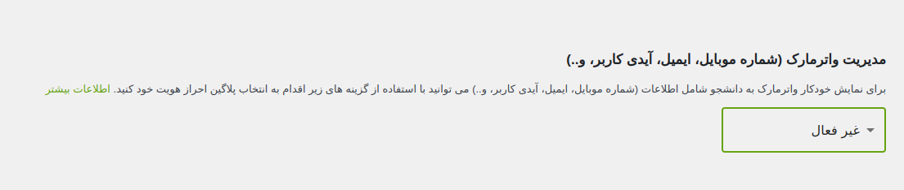

برای تغییر اندازه فونت، شما می‌توانید از پلاگین [فونت ماندگار](https://wordpress.org/plugins/parsi-font/) استفاده کنید.

### مراحل نصب و تنظیمات پلاگین:

1. پلاگین "فونت ماندگار" را نصب و فعال کنید.
2. وارد تنظیمات وردپرس خود شوید.
3. روی گزینه `فونت ماندگار − پیوسته` کلیک کنید.



### اضافه کردن کلاس دلخواه:

در بخش `عناصر دلخواه ۱`، مقدار زیر را اضافه کنید:

```text
.vidprotect-link
