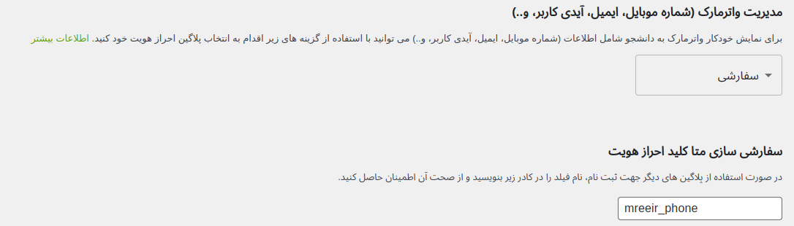
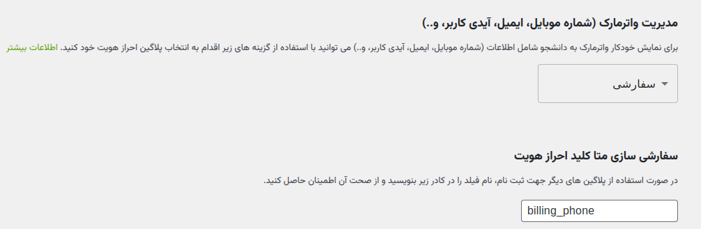

### شماره موبایل

برای نمایش شماره موبایل کاربر بر روی صفحه، می‌توانید از پلاگین‌های پشتیبانی ‌شده استفاده کنید.

#### دیجیتس

#### کراسنو

#### ورودک

:::warning
در صورتی که پلاگین انتخاب شده نصب یا فعال نشده باشد، ویدیو بدون واترمارک به
کاربر نمایش داده می شود.
:::

### واترمارک سفارشی

:::note
همچنین شما می‌توانید با انتخاب گزینه **سفارشی**، در صورت استفاده از پلاگین‌های دیگر جهت نمایش اطلاعات شامل (شماره موبایل، ایمیل، ایدی
کاربر، و...)، نام فیلد را در کادر `Custom Auth Meta Key` وارد کرده و از صحت آن اطمینان حاصل کنید.
:::

:::warning
در صورتی که پلاگین نتواند اطلاعات شامل (شماره موبایل، ایمیل، ایدی کاربر، و...) را پیدا کند، ویدیو بدون واترمارک به
کاربر نمایش داده می شود.
:::

### آزمایشی

:::warning
در صورت انتخاب گزینه `آزمایشی`، کاربر توانایی انتخاب شماره موبایل را دارد.
:::

صفحه‌ای که بعد از انتخاب گزینه `آزمایشی` به کاربران نمایش داده می‌شود:

 
### غیر فعال

:::warning
در صورت انتخاب گزینه **غیر فعال**، ویدیو بدون واترمارک به کاربر نمایش داده می شود.
:::

 