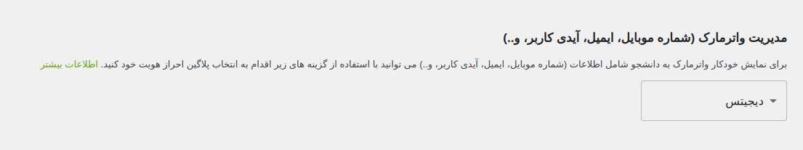
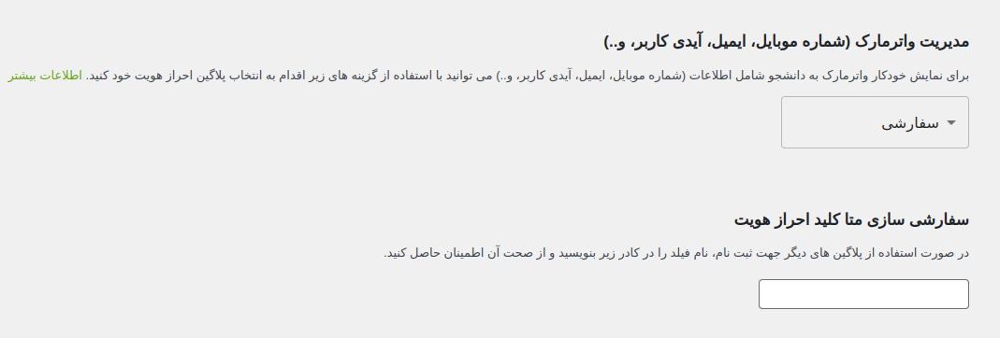
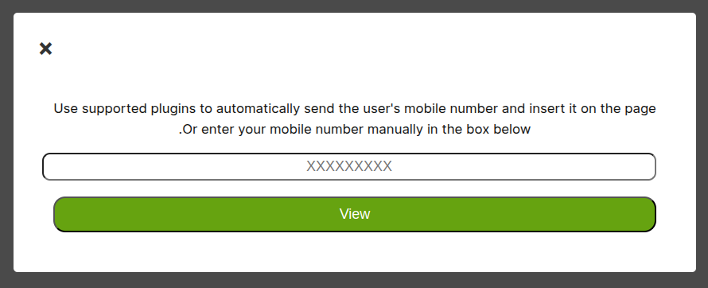

برای نمایش شماره موبایل کاربر بر روی صفحه، می‌توانید از پلاگین‌های پشتیبانی‌شده استفاده کنید.

:::note
همچنین شما می‌توانید با انتخاب گزینه سفارشی، در صورت استفاده از پلاگین‌های دیگر جهت نمایش شماره موبایل، نام فیلد را در کادر `Custom Auth Meta Key` وارد کرده و از صحت آن اطمینان حاصل کنید.
:::

:::warning
در صورت انتخاب گزینه `غیر فعال`، کاربر توانایی انتخاب شماره موبایل را دارد.
:::

صفحه‌ای که بعد از انتخاب گزینه `غیر فعال` به کاربران نمایش داده می‌شود:

